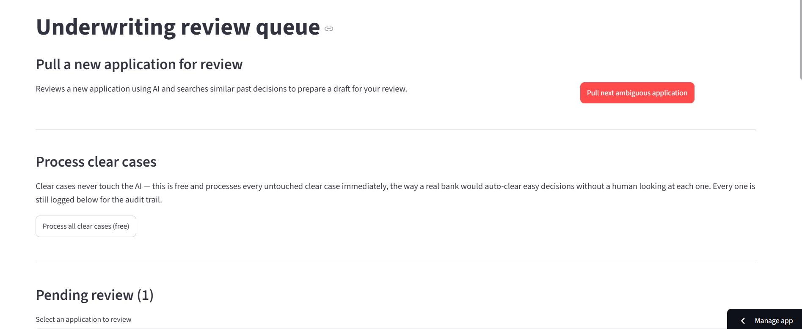
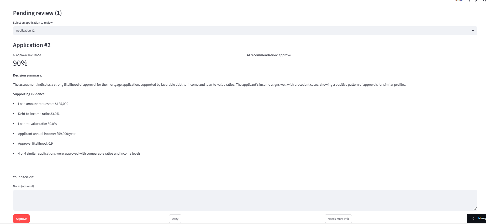
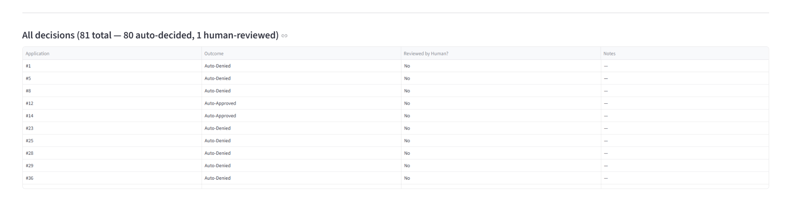

# Human-in-the-Loop Credit Underwriting Agent

A LangGraph agent that helps a credit union review mortgage applications — simple cases get decided instantly by rule, genuinely unclear cases get AI-assisted analysis grounded in real historical precedent, and a human always makes the final call on anything uncertain.

**Live demo:** https://credit-underwriting-agent.streamlit.app/

Built on real 2024 HMDA mortgage data for Visions Federal Credit Union, Broome County, NY.

---



---

## Why this exists

Lenders are legally required (Equal Credit Opportunity Act / Regulation B) to give specific, individualized reasons when denying credit — not a generic "computer says no." That requirement is the actual reason this system pauses for a human on anything uncertain, rather than just a design preference.

## How it works

```
New application
      │
      ▼
Deterministic check (debt-to-income, loan-to-value)
      │
      ├── Clearly fine / clearly risky → decided instantly, no AI, logged
      │
      └── Genuinely unclear (80% of applications)
                │
                ▼
          Search for similar past decisions (Qdrant, semantic search)
                │
                ▼
          AI forms a risk assessment, grounded in that precedent
                │
                ▼
          AI drafts a plain-English summary for a human reviewer
                │
                ▼
          ⏸  Pauses and waits — for minutes, hours, or days
                │
                ▼
          Human approves, denies, or requests more info
                │
                ▼
          Decision recorded, queue updated
```

## Screenshots

### AI-assisted review


### Full decision audit log


## Highlights

- **Real human-in-the-loop, not a simulation of one** — the pause is a genuine LangGraph `interrupt()`, persisted via SQLite. Proven by starting a review, killing the Python process entirely, and resuming it in a fresh terminal — the system picked up exactly where it left off.
- **Deterministic-first design** — 20% of applications are decided by simple, auditable rules with zero AI cost. The AI is only used where a clear rule genuinely can't decide.
- **Eval-driven, not just built-and-shipped** — ran a full evaluation against real historical lending outcomes, found a specific failure mode (the AI over-trusting misleading precedent, responsible for 69% of all errors), and fixed it with a validated, zero-cost threshold recalibration that improved denial recall 4x.
- **Privacy-aware by construction** — race, ethnicity, sex, and age are present in the raw data (HMDA requires this for fair-lending audits) but are never extracted into the features the AI sees, so they're structurally impossible to leak into a decision.
- **Complete audit trail** — every decision, whether auto-decided or human-reviewed, is logged with its outcome and reasoning.

## Results

Evaluated against real historical lending outcomes:

| | Before threshold tuning | After |
|---|---|---|
| Overall accuracy | 84.3% | 87.8% |
| Denial recall | 12.7% | 52.7% |

(A system that always guessed "approve" would score 82.4% — accuracy alone is a misleading metric on imbalanced data, which is why denial recall mattered more here.)

## Tech stack

| Layer | Tool |
|---|---|
| Orchestration | LangGraph, `SqliteSaver` checkpointing |
| LLM | OpenAI `gpt-4o-mini` |
| Embeddings + vector search | OpenAI `text-embedding-3-small`, Qdrant (local mode) |
| Structured output | Pydantic |
| UI | Streamlit |
| Data | pandas |

## Setup

```bash
git clone https://github.com/shivaniharane/credit-underwriting-agent.git
cd credit-underwriting-agent
pip install -r requirements.txt
```

Create a `.env` file:
```
OPENAI_API_KEY=your-key-here
```

Build the precedent index (one-time, costs under a cent):
```bash
python build_precedent_index.py
```

Launch the UI:
```bash
streamlit run app.py
```

## Project structure

```
credit-underwriting-agent/
├── data/                        # Source HMDA dataset
├── screenshots/                 # UI screenshots
├── src/
│   ├── state.py                 # LangGraph state schema
│   ├── features.py              # Raw application → decision-safe features
│   ├── routing.py               # Deterministic clear/ambiguous classification
│   ├── investigation.py         # Qdrant precedent search
│   ├── assessor.py              # LLM risk assessment
│   ├── compliance_writer.py     # Decision summary generation
│   ├── review_queue.py          # Queue management for the UI
│   └── graph.py                 # LangGraph orchestration + HIL interrupt
├── build_precedent_index.py     # One-time precedent index builder
├── app.py                       # Streamlit review UI
├── start_review.py              # CLI proof of interrupt persistence
├── resume_review.py             # CLI proof of resume across process restart
├── eval_harness_final.py        # Full evaluation against real outcomes
├── threshold_analysis.py        # Zero-cost threshold recalibration
└── eval_results_final.csv       # Raw evaluation results
```

## Known limitation

Precedent search and AI assessment can only see what HMDA actually reports — which notably does not include credit scores or credit history detail, the single most common real denial reason. This is a genuine, structural ceiling on accuracy, not a fixable bug — and it's the concrete reason the human-in-the-loop step exists rather than full automation.